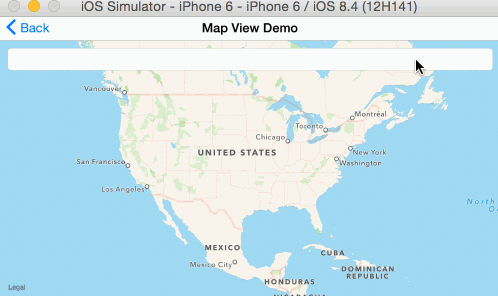
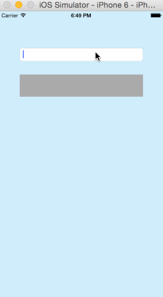
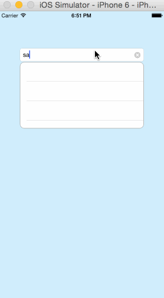
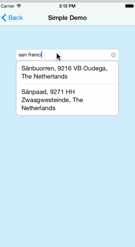

# ZTDropDownTextField


## Table of contents

 * [Features](#features)
 * [Demo](#demo)
 * [Installation](#installation)
    * [Cocoapods](#cocoapods)
    * [Source files](#source-files)
    * [Example](#example)
 * [Usage](#usage)
    * [Basics](#basics)
    * [DataSourceDelegate](#datasourcedelegate)
 * [Customization](#customization)
 * [Requirments](#requirements)
 * [Credit](#credit)
 * [Remains to do](#remains-to-do)
 * [License](#license)

***

## Features

 * [x] Provide dropdown suggestions below UITextField
 * [x] Alterantive of UISearchController
 * [x] Dropdown list will hide automatially, when user tap outside of it
 * [x] Implemented with AutoLayout, support both portrait and landscape
 * [x] Provide delegate methods for dropdown list events
 * [x] Dropdown list UI is customizable
 * [x] Swift Dynamic Framework, easy to integrate

## Demo

Portrait | Landscape
------------- | -------------
[](ZTDropDownTextField-Portrait.gif)  | [](ZTDropDownTextField-Lanscape.gif)

Slide Animation  | Expand Animation | Flip Animation 
------------- | ------------- | ---------------
[](ZTDropDownTextField-Slide.gif)  | [](ZTDropDownTextField-Expand.gif) |  [](ZTDropDownTextField-Flip.gif)

## Installation

### Cocoapods

[CocoaPods](http://www.cocoapods.org) recommended to use ZTDropDownTextField.

1. Add `pod 'ZTDropDownTextField'` to your *Podfile*.
2. Install the pod(s) by running `pod install`.
3. Include ZTDropDownTextField wherever you need it with `import ZTDropDownTextField`.


### Source files

1. Download the [latest code version](https://github.com/ziyang0621/ZTDropDownTextField/archive/master.zip) or add the repository as a git submodule to your git-tracked project.
2. Drag and drop ZTDropDownTextField directory from the archive in your project navigator. Make sure to select *Copy items* when asked if you extracted the code archive outside of your project.
3. Include ZTDropDownTextField wherever you need it with `import ZTDropDownTextField`.

### Example
1. Download the [latest code version](https://github.com/ziyang0621/ZTDropDownTextField/archive/master.zip)
2. Double click to open the `ZTDropDownTextField.xcworkspace` file

## Usage

Check out the provided example app for how you can use the ZTDropDownTextField.

### Basics

Add the following import to the top of your Swift file which needs a dropdown textfield.

   ```swift
   import ZTDropDownTextField
   ```

### IBOutlet 

You can declare a ZTDropDownTextField with an IBOutlet and connect it to your storyboard or nib file.

   ```swift
  @IBOutlet weak var dropDownTextField: ZTDropDownTextField!
  ```

### DataSourceDelegate

There are 3 delegate methods which you have to implement, if your view controller conform with `ZTDropDownTextFieldDataSourceDelegate`.

You can let your view controller become a `ZTDropDownTextFieldDataSourceDelegate` by doing the following:

   ```swift
  dropDownTextField.dataSourceDelegate = self
  ```

Example of implementing `ZTDropDownTextFieldDataSourceDelegate` method

   ```swift
extension ViewController: ZTDropDownTextFieldDataSourceDelegate {
    func dropDownTextField(dropDownTextField: ZTDropDownTextField, numberOfRowsInSection section: Int) -> Int {
        return myList.count
    }
    
    func dropDownTextField(dropDownTextField: ZTDropDownTextField, cellForRowAtIndexPath indexPath: NSIndexPath) -> UITableViewCell {
        var cell = dropDownTextField.dropDownTableView.dequeueReusableCellWithIdentifier("Cell") as? UITableViewCell
        if cell == nil {
            cell = UITableViewCell(style: .Default, reuseIdentifier: "Cell")
        }
        
        cell!.textLabel!.text = myList[indexPath.row]
        
        return cell!
    }
    
    func dropDownTextField(dropdownTextField: ZTDropDownTextField, didSelectRowAtIndexPath indexPath: NSIndexPath) {
       println("drop down list row did select")
    }
}
   ```
   
## Customization

The dropdown list can have 3 different animations, including `Basic`, `Slide`, `Expand` and `Flip`. See the animations in [Demo](#demo).
```swift
public enum ZTDropDownAnimationStyle {
    case Basic
    case Slide
    case Expand
    case Flip
}
```
```swift
  dropDownTextField.animationStyle = .Slide
```


The `rowHeight` and `dropDownTableViewHeight` can be customized by changing the value of these 2 variables
```swift
  public var rowHeight:CGFloat = 50
  public var dropDownTableViewHeight: CGFloat = 150
```

## Requirements

* Xcode 6
* iOS 7
* ARC
* Frameworks:
    * UIKit

## Remains to do

- [ ] Swift 2.0
- [ ] More customizations

 
## Credit

- [Facebook pop](https://github.com/facebook/pop)


## License

    The MIT License (MIT)
    
    Copyright (c) 2015 Ziyang Tan
    
    Permission is hereby granted, free of charge, to any person obtaining a copy
    of this software and associated documentation files (the "Software"), to deal
    in the Software without restriction, including without limitation the rights
    to use, copy, modify, merge, publish, distribute, sublicense, and/or sell
    copies of the Software, and to permit persons to whom the Software is
    furnished to do so, subject to the following conditions:
    
    The above copyright notice and this permission notice shall be included in all
    copies or substantial portions of the Software.
    
    THE SOFTWARE IS PROVIDED "AS IS", WITHOUT WARRANTY OF ANY KIND, EXPRESS OR
    IMPLIED, INCLUDING BUT NOT LIMITED TO THE WARRANTIES OF MERCHANTABILITY,
    FITNESS FOR A PARTICULAR PURPOSE AND NONINFRINGEMENT. IN NO EVENT SHALL THE
    AUTHORS OR COPYRIGHT HOLDERS BE LIABLE FOR ANY CLAIM, DAMAGES OR OTHER
    LIABILITY, WHETHER IN AN ACTION OF CONTRACT, TORT OR OTHERWISE, ARISING FROM,
    OUT OF OR IN CONNECTION WITH THE SOFTWARE OR THE USE OR OTHER DEALINGS IN THE
    SOFTWARE.
